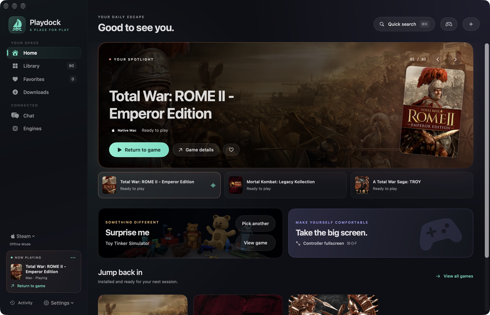
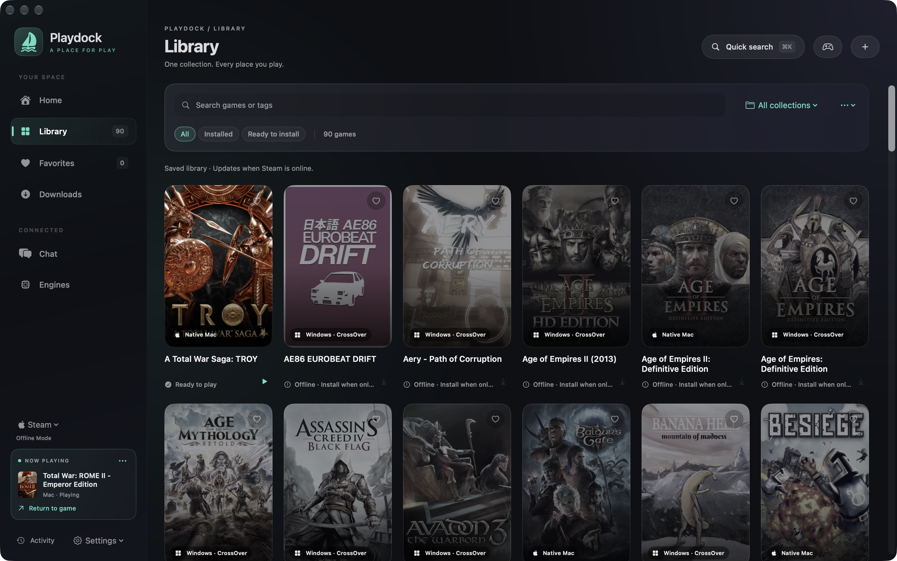
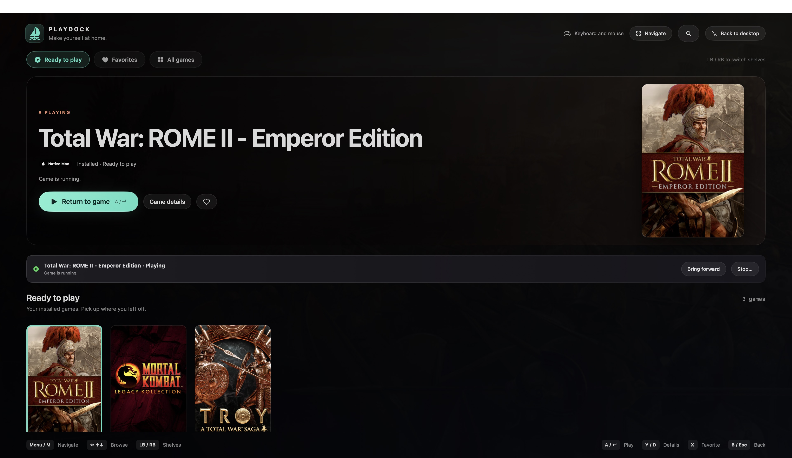

# Playdock

A native macOS game library. Playdock uses Mac Steam for your library and runs supported Windows games through CrossOver. Add non-Steam games with CrossOver, Wine, or compatible GPTK.

- Search, favorites, collections, downloads, achievements, and Workshop mods.
- Per-game compatibility settings, prefix browsing, and local save backups.
- Quick launcher (`⌘K`) and controller fullscreen (`⌘⇧F`).

Steam handles sign-in, licenses, updates, and game services. Games open in their own windows.



<details>
<summary>Library and controller fullscreen</summary>





</details>

## Getting started

Runs on Apple silicon Macs with macOS 13+. Install Steam, then follow Playdock’s first-launch setup. You can enable Windows support later in **Engines**; **Settings → Set up Playdock** reopens setup.

Windows Steam support requires Apple silicon, macOS 26+, and activated CrossOver Preview 20260821 or 20261006. Playdock patches Steam and prepares a separate runner; setup restarts Steam. Compatibility depends on the game and supported Steam/CrossOver builds. CrossOver and games are supplied separately.

## Building

Build with Xcode 26+ (Swift 6.2) and CMake on an Apple silicon Mac: open `Playdock.xcodeproj`, select **Playdock / My Mac**, and run. To package the app:

```sh
bash Scripts/build.sh
open build/Playdock.app
```

Outputs: `build/Playdock.app` and `build/Playdock-macOS-arm64.zip`. Builds are ad-hoc signed and not notarized. See [CONTRIBUTING.md](CONTRIBUTING.md) for checks and release preparation.

## Limitations

- Steam controls use private client APIs that can change. Sign-in and some confirmations open Steam; Workshop browsing and web chat open a browser.
- Windows support is experimental. Steam updates can require bridge updates; offline play depends on Steam and each game.
- Settings, caches, owned prefixes, and save backups: `~/Library/Application Support/Playdock/`. Logs: `~/Library/Logs/Playdock/`; review raw logs before sharing.

## License

[GNU GPL-3.0](LICENSE). Commercial use is allowed; distributed derivatives must retain GPL licensing and provide corresponding source. See [NOTICE](NOTICE) for attribution and component licenses. Playdock is independent of Valve and CodeWeavers.
